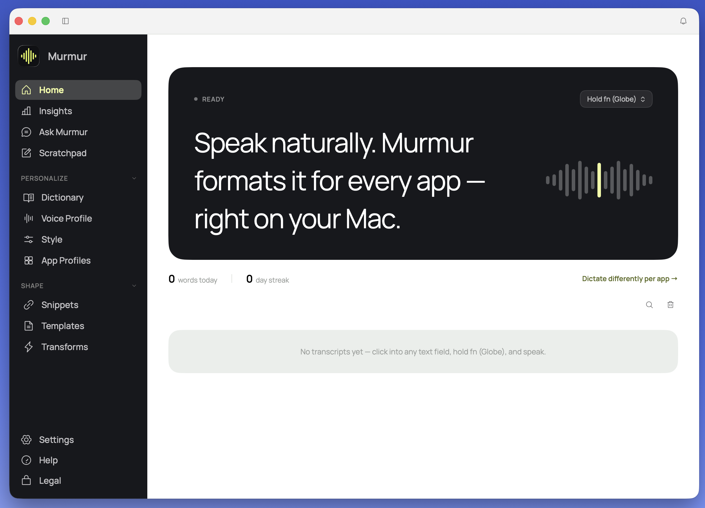

# Murmur 🎙️

**Private, unlimited voice dictation for macOS — 100% on-device.**

Hold `fn`, speak, release — clean text appears at your cursor in any app.
Choose your microphone in **Settings → Dictation → Microphone**. The default
is **System default**, which follows macOS Sound settings at the start of each
recording. A selected device is remembered across restarts; reconnect it or
choose another if it becomes unavailable. For Bluetooth playback without
headset microphone mode switching, select a built-in or USB microphone.
No cloud, no subscription, no word limits. Your audio and transcripts never
leave your Mac.

<picture>
  <source media="(prefers-color-scheme: dark)" srcset="Resources/screenshot-dark.png">
  
</picture>

Murmur is an open-source, fully local take on the modern AI dictation app
(in the spirit of Wispr Flow), built natively in Swift on Apple's on-device
speech and language models, with an optional local Whisper engine.

## About this fork

This is a personal fork of [Murmur by janisbelozerovs-dev](https://github.com/janisbelozerovs-dev/murmur), maintained by [csatwood](https://github.com/csatwood). It is not an official upstream release. The original copyright and [MIT license](LICENSE) are retained, along with upstream history and contributor credit.

The default `personal` branch is based on upstream commit [`0627909`](https://github.com/janisbelozerovs-dev/murmur/commit/0627909) (Murmur 2.1.0). It does not automatically include later upstream changes. The `main` branch retains the upstream snapshot taken when this fork was created.

The [upstream review](docs/upstream-review.md) records the nine later upstream commits, useful fixes, merge conflicts, and the upstream updater risk. This fork selectively ports fixes from those commits; it does not merge the complete upstream history. GitHub may therefore still report it as behind even when a specific fix is included.

## Changes in this fork

- **Microphone selection:** Settings → Dictation → Microphone offers System default and connected inputs. Upstream pinned recording to the built-in microphone. System default now follows macOS input settings, allowing an external microphone to work with a laptop lid closed. Explicit selections use persistent device IDs; a disconnected selection produces an error instead of silently recording another input.
- **Fast dictation by default:** “As spoken” skips the automatic AI rewrite while retaining punctuation, basic filler removal, spoken layout commands, learned corrections, snippets, and English grammar checks. Explicit styles and templates still use AI. Enable **Settings → Dictation → Automatic AI cleanup** to restore the upstream cleanup pass. Fast mode does not perform the AI pass's false-start removal or restructuring of rambling speech. Raw mode keeps its existing behavior.
- **Selected upstream correctness fixes:** known user vocabulary is protected during English grammar checking. Automatic learning no longer stores single ordinary-word substitutions from transcript edits; deliberate Voice Training and saved corrections remain intact. Abbreviation commas such as `p.m.,` survive formatting, and periods inside abbreviations no longer capitalize the next letter. These selectively adapt upstream `dd05b3b` and `f319a8a`; they do not enable developer-vocabulary guessing or change Parakeet.
- **Build compatibility:** structured Apple Intelligence output uses explicit `Generable` conformance instead of requiring the Foundation Models macro plugin. The app build script accepts Swift build arguments and packages fonts from their source directory.

### Performance checks

The first optimization removes an automatic AI rewrite from ordinary dictation; it does not replace the recognition engine. In two live baseline recordings, recognition took 0.24–0.36 seconds while subsequent processing added 2.87–3.93 seconds. Those observations identified the delay rather than establishing a general speed guarantee.

A local comparison with Hex 2.1.18 used the same two synthetic WAV files, one warmup pass, and three measured passes. Median warm recognition times were:

| Clip | This fork: Parakeet v2 / FluidAudio | Hex: Parakeet Unified English / transcribe.cpp |
| --- | ---: | ---: |
| 2.5-second sentence | 158 ms | 252 ms |
| 10.3-second paragraph | 203 ms | 596 ms |

These are different model variants and runtimes. Murmur's timing includes its file conversion; Hex's benchmark times prepared audio. Results exclude recording, insertion, and cold model loading. Two synthetic clips do not establish an accuracy ranking or performance on other machines.

The sections below describe Murmur's inherited features and build process.

## Features

- **Push-to-talk dictation** — hold `fn` (or right ⌥) anywhere; release to
  paste at your cursor. Double-tap for hands-free mode.
- **Four recognition engines**, all offline:
  - **Apple** — instant, built into macOS (SpeechAnalyzer, macOS 26).
  - **WhisperKit** — precision engine via
    [WhisperKit](https://github.com/argmaxinc/WhisperKit) (CoreML on the
    Neural Engine). Your vocabulary is fed into the decoder prompt.
  - **whisper.cpp** — the same Whisper models, running via Metal on the
    GPU instead, with phrase-based filtering for the sign-off
    hallucinations ("Thank you.", etc.) Whisper-family models are known to
    produce on near-silent audio.
  - **Parakeet** — NVIDIA's model via
    [FluidAudio](https://github.com/FluidInference/FluidAudio) (CoreML on
    the Neural Engine). Murmur's fastest engine; no vocabulary biasing yet.
- **Harper grammar pass** — [Harper](https://github.com/Automattic/harper)
  runs after basic cleanup and any requested Apple Intelligence edit: deterministic,
  millisecond-speed local linting (agreement, punctuation, repeated words)
  that catches what an LLM edit occasionally misses. No model, no warm-up,
  no network.
- **Per-app profiles** — one place to set what Murmur does when you dictate
  into a specific app: tone and note template together, instead of two
  separate override systems answering "what happens in Slack?" differently.
- **Ask Murmur** — ask questions about your own dictation history, answered
  entirely on-device via lightweight keyword retrieval into the local model
  (no embeddings, no network).
- **Note templates** — restructure a transcript into a specific document
  shape via the on-device LLM; trigger one by voice at the start of a
  dictation, or apply manually.
- **Pronunciation learning** — a Voice Training page learns how *you* say
  tricky words; corrections you make to transcripts are diffed and learned
  automatically; everything biases future recognition.
- **Cleanup pipeline** — filler-word removal, spoken "new line"/"new
  paragraph", auto-capitalization, personal dictionary, snippets
  (say a trigger phrase → paste a saved block).
- **Styles** — per-app tone rewriting (formal / casual / very casual) using
  Apple Intelligence's on-device model.
- **Transforms** — select text in any app, press ⌥1 to polish grammar or ⌥2
  to turn rough notes into a structured AI prompt, rewritten in place.
- **Dashboard** — history with search and correction-learning, usage stats
  (words, WPM, day streak), insights chart, a Voice Profile persona derived
  locally from what you dictate, scratchpad.
- **Guided first run** — welcome → permissions → recognition engine →
  hotkey → mic test, shown once.

## Requirements

- macOS 26 (Tahoe) or newer
- Apple Silicon Mac
- Xcode 26 command-line tools (`xcode-select --install`)
- For Styles / Transforms / Voice Profile: Apple Intelligence enabled
- For the Whisper engine: a one-time model download (150 MB – 1.6 GB)

## Build & run

```bash
git clone <this-repo>
cd murmur
./scripts/make_app.sh     # builds build/Murmur.app
open build/Murmur.app
```

Run `./scripts/make_signing_cert.sh` once to create the local signing certificate
required by the build script. Reusing this certificate preserves permission
grants across rebuilds. The build stops if the certificate is missing.

To select an installed SDK, pass Swift build arguments through the script:

```bash
./scripts/make_app.sh --disable-automatic-resolution --sdk /path/to/MacOSX.sdk
```

### One-time permissions

1. **Microphone** — allow when prompted on first dictation.
2. **Accessibility** — allow when prompted (needed for the global hotkey and
   for pasting). If the app still shows it as missing, use *Settings →
   Reset Grant & Relaunch* inside Murmur.

## CLI test modes

```bash
.build/debug/Murmur --selftest                          # formatter + learning tests
.build/debug/Murmur --transcribe audio.wav              # Apple engine
.build/debug/Murmur --transcribe audio.wav --engine whisper
.build/debug/Murmur --format "um hello new line hi"     # cleanup pipeline only
.build/debug/Murmur --transform "fix this grammer pls"  # on-device LLM polish
```

## Privacy

Everything runs on this Mac: recognition (Apple SpeechAnalyzer or a local
Whisper/Parakeet model), cleanup, tone rewriting (Apple Intelligence), and
the Voice Profile analysis. Murmur makes no network requests except the
one-time model downloads by macOS itself (Apple speech assets) and, if you
opt into a non-Apple engine, that model's own one-time fetch (Hugging Face
for Whisper, FluidAudio's own CDN for Parakeet). Dictation data is stored
only in `~/Library/Application Support/Murmur/`.

## Architecture

Swift Package. WhisperKit and FluidAudio are remote SwiftPM dependencies,
each used only if you pick that engine; whisper.cpp/ggml and Harper are
vendored as prebuilt xcframeworks under `Vendor/` (Harper's Rust source is
included, whisper.cpp's isn't — see [NOTICE.md](NOTICE.md) for both).

```
HotkeyMonitor  →  AudioRecorder  →  Transcriber (Apple / WhisperKit / whisper.cpp / Parakeet)
                                        ↓
     TextFormatter → LearnedStore → SnippetStore → RewriteEngine (Styles) → HarperChecker
                                        ↓
                        TextInserter (clipboard + ⌘V)
```

See [PLAN.md](PLAN.md) for the original design document and
[CHANGELOG.md](CHANGELOG.md) for what's new in each release.

## License

[MIT](LICENSE). Not affiliated with Wispr Flow, OpenAI, NVIDIA, or Apple.

## Testing the selected upstream fixes

Run `./scripts/test_corrections.sh` for isolated formatter, learning-store and Harper integration checks. It uses temporary storage and links the same vendored Harper archive as the app. An optional first argument selects an installed SDK.

The Harper source, C headers and vendored archive are imported together from upstream commit `dd05b3b`. Normal app builds use that archive and do not require Rust. To rebuild Harper itself, install Rust and LLVM, then run `./scripts/build_harper.sh`; optional Swift build arguments are forwarded to its final link check. The Rust dependency lockfile is enforced. Rust tests were not run during this port because the local Rust toolchain was unavailable; the Swift integration checks exercise the actual shipped archive.
